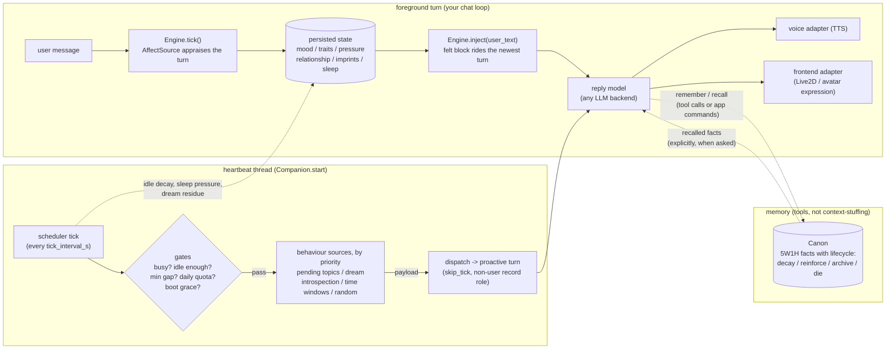

# Wiring feltstate into a desktop companion

This is the assembly manual. The README explains *what* the library models;
this page explains *where each piece sits* in a running companion — a desktop
pet, a VTuber, a chat bot — and what talks to what, in what order, on which
thread.

Everything below is demonstrated by two runnable, zero-dependency examples:

| | file | what it shows |
|---|---|---|
| guided tour | [`examples/companion.py`](../examples/companion.py) | the orchestration, narrated step by step with simulated clocks |
| live loop | [`examples/companion_live.py`](../examples/companion_live.py) | the same `Companion`, but *interactive*: you talk, a real heartbeat runs, it initiates on its own, memory survives restarts |

Every transcript quoted on this page is the actual output of
`FELTSTATE_LIVE_FAST=1 python examples/companion_live.py` — run it yourself.

---

## 1. The wiring diagram



Three ownership rules make this diagram safe to build on:

1. **The reply model never writes persisted affect.** The `AffectSource`
   (keyword rules, a small classifier, a separate LLM — anything) appraises the
   turn; the engine integrates it. The reply model only ever *reads* the
   rendered result. It cannot decide it is now ecstatic and make that stick.
2. **State reaches the model as context, never as commands.** The felt block is
   first-person description ("mood: relieved | level, low energy"), not
   "respond sadly."
3. **Memory is a store with a lifecycle, not a context dump.** Facts are
   written and recalled explicitly (tool calls, app commands); recall bumps
   salience ("used memory sticks"), disuse lets it fade, and the archive/audit
   trail keeps deletion honest.

---

## 2. Prompt assembly — what goes where, and why

One turn produces exactly this message array (`companion/round.py`):

```text
messages = [
  {"role": "system", "content": SYSTEM_PROMPT},        # ← static, byte-stable
  ...prior turns...                                    # ← append-only history
  {"role": "user", "content": FELT_BLOCK + user_text}, # ← dynamic, newest turn
]
```

The partition rule:

| goes in the **system prompt** (stable prefix) | goes in the **per-turn injection** (newest user message) |
|---|---|
| persona: who the companion is | `[how I feel right now]` — mood, tone bands |
| voice & style ground rules | relationship line ("with you: warming · mostly trusting") |
| how to treat the felt block ("state, not a command") | pressure phase / aftertaste ("inside: pressure clear \| settled") |
| tool definitions (if using function calling) | time sense ("now Sat afternoon 12:11", "3 days since we last spoke") |
| — | lingering traces, dream residue hints |

**Why this split exists: prompt caching.** Every byte of the system prompt and
the prior turns is identical across turns, so providers that cache prompt
prefixes only re-process the newest message. The felt block *changes every
turn* — putting it in the system prompt would invalidate the whole cache each
time. Riding it on the newest user turn costs a few hundred uncached tokens
instead of the entire prefix. The block itself is also written in coarse
discrete bands, so two adjacent ticks whose numbers barely moved render
byte-identically.

A real injected block, from the live example (`/state`):

```text
[how I feel right now]
now Sat afternoon 12:11
with you: warming · mostly trusting · mostly safe
mood: relieved | level, low energy
inside: pressure clear | settled
lingering: a faint trace of the last moment, half-faded
underneath: spirits steady · nerves even · moderately curious · even-keeled
```

Note what is *absent*: numbers, instructions, mechanism names. The reply model
gets a felt description at the same altitude as the rest of its context.

---

## 3. The heartbeat — cadence and duties

`Companion.start()` runs one background thread. Each beat:

1. applies idle decay / sleep pressure to the persisted state,
2. walks the **gates** (hard silence rules),
3. if the gates pass, asks each **behaviour source** in priority order to
   propose a payload,
4. dispatches the first proposal as a proactive turn, then lets the source
   **commit** (e.g. mark the topic consumed) only after delivery succeeded.

The knobs (`SchedulerConfig`), with sane real-app values:

| knob | default | meaning |
|---|---|---|
| `tick_interval_s` | 300 | how often the heartbeat checks |
| `user_idle_min_s` | 3600 | never initiate within this of a user message |
| `min_gap_s` | 1800 | minimum gap between any two ordinary fires |
| `daily_max` | 8 | ordinary proactive fires per day |
| `boot_grace_s` | 300 | quiet window right after start (no wake-up burst) |
| `solitude_min_s` | 1800 | introspection additionally needs this much solitude |
| `resume_gap_s` | 600 | a quiet gap this long counts as "machine resumed" |

Two properties worth copying even if you rebuild this layer yourself:

* **propose / dispatch / commit.** The topic store is only marked consumed
  *after* the line was actually delivered — a crash mid-dispatch leaves the
  topic pending instead of silently eating it.
* **fail-open presence.** If the presence probe breaks, idle reads as
  "infinite" and busy reads as "false": a broken sensor mutes initiative
  gating, it does not kill the companion.

---

## 4. The proactive path, end to end

From the live example — the user dropped `/note ask how the demo went`, then
just... stopped typing. Twenty-odd seconds later (fast timers), with no user
turn at all:

```text
  (her expression shifts: relieved)

ivy (curious)> "It's gone quiet — earlier I meant to: ask how the demo went."
```

What happened, in order (all in `companion/app.py` + `scheduler.py`):

1. the heartbeat tick passed the gates (idle > `user_idle_min_s`, quota fine);
2. `PendingTopicsSource` (priority 0 — highest) proposed the oldest unconsumed
   topic;
3. the dispatcher ran a **proactive turn**: same engine, same reply model, but
   `skip_tick=True` (the companion's own prompt must not be appraised as user
   affect — no self-reinforcement) and a non-user record role (the prompt is
   stored for the record but never replayed as if the user had said it);
4. the reply left through the same voice/frontend adapters as any turn;
5. only then was the topic marked consumed — the commit step.

The same path carries dreams (empty payload → state shifts, nothing spoken),
introspection, time-window greetings, and random check-ins. One pipe, many
sources, uniform gating.

---

## 5. Memory in the loop

Also from the live run — stored in one session, recalled after a full process
restart:

```text
you> /remember my favourite tea is oolong
  (kept: "my favourite tea is oolong")
...        (process exited, state on disk, started again)
========================================================================
companion_live — Ivy is up. (fast timers)
She was here before: her mood and memory carried over from last run.
========================================================================
you> do you remember my tea?
ivy (content)> "I kept that one: my favourite tea is oolong."
```

The demo backend maps "do you remember…?" to `canon.search()` directly; a real
LLM backend exposes the same five calls as **function-calling tools** instead —
`remember / recall / correct / retract / history` — so the model itself decides
when to dig. Either way the properties are the library's, not the model's:
recalled facts gain salience, unused ones fade toward the archive, corrections
keep the old belief auditable (`history()` / `as_of()` can answer "what did I
*used to* think?").

---

## 6. Swapping the fakes for the real thing

The examples ship with terminal adapters; each is one class swap:

| slot | demo | real integration |
|---|---|---|
| reply model | `TemplateBackend` | any OpenAI-compatible endpoint (see `examples/with_llm.py`), or your own client — anything with `complete(messages) -> str` |
| affect source | `KeywordSource` | a small classifier, a cheap LLM judge, a fine-tuned head (`examples/vheart_source.py`) — anything returning an `AffectDelta` |
| skin | `TerminalFrontend` | map the label to a Live2D expression index / hotkey and push it (an `[emotion]` tag at sentence start can drive both the face and the TTS colour) |
| voice | `TerminalVoice` | your TTS; `emotion_hint` carries the label so the voice can colour delivery |
| presence | `WallClockPresence` | OS idle time, focused-window checks, VAD state — anything answering "is the user around?" |

The loop code does not change when any of these swap — that seam is the
library's contract.

---

## 7. Privacy boundary (read before bridging to chat platforms)

If the companion is reachable over a bridge (Discord, Telegram, a web page),
treat the bridge as an **untrusted surface**:

* the only state that crosses an interface is the *rendered first-person
  block* — never raw stores;
* `state.json`, `canon.jsonl`, scheduler state, API keys stay on the machine
  the companion lives on;
* per-surface, write down what it can see and what it can never see; if
  multiple people can talk to it, key relationship state per speaker and never
  leak one person's context into another's turn.

A fuller layering write-up (body / bridge / soul) is planned; this section is
the part you should not defer.

---

*Further reading:* [PROMPT_SHAPES.md](PROMPT_SHAPES.md) — the rendered blocks
and the variant master table · [PROMPT_STACK.md](PROMPT_STACK.md) — partition,
sandwich ordering, and the forget-probe pattern ·
[OUTPUT_CHAIN.md](OUTPUT_CHAIN.md) — reply → face and voice, streaming and
renderer portability · [MEMORY_TOOLS.md](MEMORY_TOOLS.md) — memory as
function-calling tools · [AGENT_WORK_UX.md](AGENT_WORK_UX.md) — narrating long
agent work without breaking character · [FAILURE_IN_CHARACTER.md](FAILURE_IN_CHARACTER.md)
— errors that don't break the fourth wall · [STYLE_SPECTRUM.md](STYLE_SPECTRUM.md)
— delivery notes: how a feeling holds a pen (optional layer).
